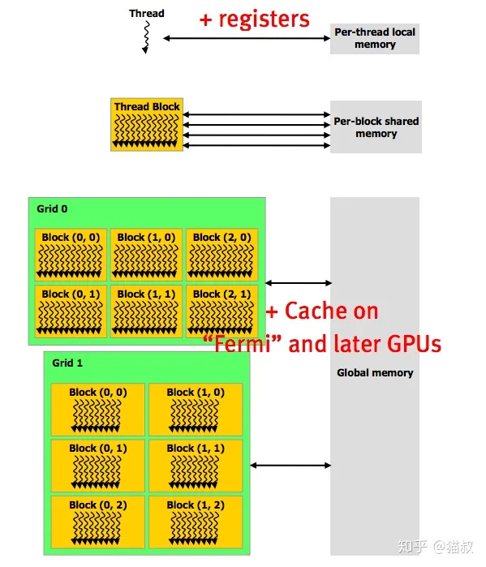
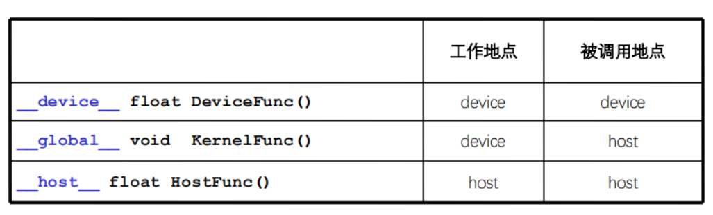
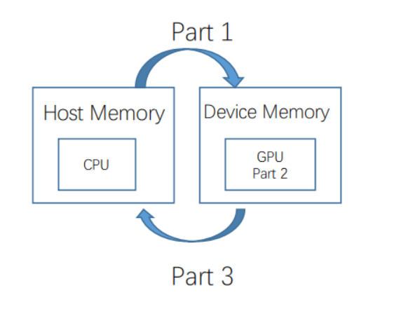
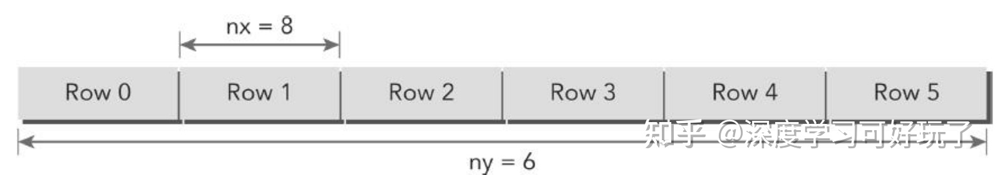
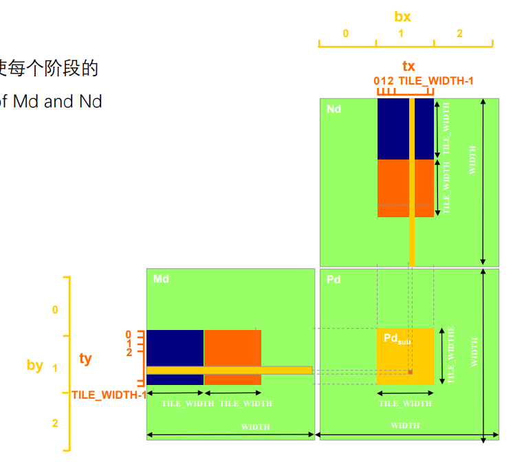

GPU编程1--GPU中的基本概念: [知乎](https://zhuanlan.zhihu.com/p/150810484)

GPU编程2--CUDA核函数和线程配置: [知乎](https://zhuanlan.zhihu.com/p/151676261)

参考博客: [blog](https://face2ai.com/program-blog/)


# 基本概念:pencil:

## 硬件资源


## 软件资源

1. **线程(Thread)**

   一个CUDA并行程序会被多个线程执行，对应SP

3. **线程块(Block)**

   数个线程组成一个块，同一个块内的线程可以同步，也可以通过共享内存通信

4. **线程网格(Grid)**

   由多个块组成


## 存储资源



每个线程都有独属于自己的局部内存和寄存器，每个块有共享内存，块内的所有线程都可以访问，每个网格有全局内存和Cache，网格内的所有线程均可访问。


## 核函数

**CUDA编程标识符号**

`__global__`标志核函数，返回必须是`void`类型。

`__device__`和`__host`可以一起用。



**调用方式：**

```c++
dim3 block(x, y, z);
dim3 grid(x, y, z);
kernelName<<<grid, block>>>(param list);
```


## 线程配置

***需要注意的是，二维排序中，Thread(0,1)表示第1行第0列的Thread，这跟我们传统中理解的横坐标和纵坐标不太一样；***

***我们定义grid(4,2)表示第一维度有4个索引值，第二个维度有2个索引值，即2行4列***


在CUDA上可以使用内置变量来获取Thread ID和Block ID：

- `threadIdx.[x, y, z]`表示Block内Thread的编号
- `blockIdx.[x, y, z]`表示Gird内Block的编号
- `blockDim.[x, y, z]`表示Block的维度，也就是Block中每个方向上的Thread的数目
- `gridDim.[x, y, z]`表示Gird的维度，也就是Grid中每个方向上Block的数目


这里假设`grid(gridDim.x, girdDim.y, gridDim.z)`和`block(blockDim.x, blockDim.y, blockDim.z)`

当`grid`和`block`的`dim3`均为3D时，可以用如下公式计算线程索引：

```c++
__device__
int getGlobalIdx_3D_3D()
{
    int blockId = blockIdx.z * gridDim.y * gridDim.x + blockIdx.y * gridDim.x + blockIdx.x;
    int threadId = blockId * (blockDim.x * blockDim.y * blockDim.z)
    + threadIdx.z * blockDim.y * blockDim.x + threadIdx.y * blockDim.x + threadIdx.x;
}
```

其中，

`grid`的`Idx`索引是从0开始的，即当`Dim=1`时，`Idx`索引为0，`block`同理。


**线程配置经验：**

- 一般Block中的thread数量要为wrapsize的整数倍
- 一般Grid中的Block数量要为GPU的SM数量的整数倍
- 一般在一定范围内Block的数量越多并行越多（但也太多会适得其反）


## 编译方式

单个文件编译：

`nvcc fileName.cu -o fileNameOut`


多个文件编译：

编写`CMakeLists.txt`，利用`CMake`进行编译。

```cmake
project(fileNameOut CUDA)  #指明编译的是CUDA文件
add_executable(fileNameOut fileName.cu)
```


## 分析工具

### `nvprof`

运行命令`nvprof ${执行命令}`会直接得到各种操作的具体耗时


# CUDA编程流程:pen:

1. 开辟设备端内存，并将数据从主机拷贝到设备端
2. 在设备端计算，即核函数部分
3. 将结果从设备端拷贝回主机端，并释放设备端内存



## 常用函数

官方`API`文档: [CUDA](https://docs.nvidia.com/cuda/cuda-runtime-api/group__CUDART__MEMORY.html#group__CUDART__MEMORY_1gc263dbe6574220cc776b45438fc351e8)


**申请设备端内存：**

`cudaError_t cudaMalloc(void** devPtr, size_t size)`

有两个参数：设备端内存地址变量和需要申请的内存大小

*注意：这里需要传入二级指针，才能将指针指向申请到的设备端内存！*


**释放设备端内存：**

`cudaError_t cudaFree(void* devPtr)`


**数据复制传递：**

`cudaError_t cudaMemcpy (void *dst, const void *src, size_t count, cudaMemcpyKind kind)`

参数：

1. 设备端数据内存指针

2. 主机端数据内存指针

3. 数据大小

4. 转移类型


*注意：这个函数操作是同步的！*


# 应用实例:label:

## 普通用法：[知乎](https://zhuanlan.zhihu.com/p/462944262)

二维矩阵在内存中是以一维线性的数组形式存放，也就是说`mat[ix][iy]`对应`array[iy*nx+ix]`如下图：




那么线程如何与矩阵坐标对应呢？

1. 首先利用线程索引和块索引映射到矩阵坐标

   `ix=threadIdx.x+blockIdx.x*blockDim.x;`

   `iy=threadIdx.y+blockIdx.y*blockDim.y;`

2. 再将矩阵坐标映射到内存中的一维数组

   `int idx=iy*nx+ix;`

*当然这里完全可以只使用一个二维的`block`，具体线程配置涉及到的知识后面再丰富！*


## 矩阵乘法




**平铺矩阵算法的线程配置思路：**

每个`block`对应一个`BLOCK_SIZE`，每个线程对应`BLOCK_SIZE`中的每一行或列。

```c++
// 2.定义BLOCK_SIZE的边界等参数
int bx = blockIdx.x;
int by = blockIdx.y;
int tx = threadIdx.x;
int ty = threadIdx.y;

int row = by * BLOCK_SIZE + ty;
int col = bx * BLOCK_SIZE + tx;
```


### 代码实现

代码的对比链接：[CSDN](https://blog.csdn.net/sinat_38368658/article/details/105117534)


### 核函数

```c++
__global__ void matrixMultiplyShared(float *A, float *B, float *C,
	int numARows, int numAColumns, int numBRows, int numBColumns, int numCRows, int numCColumns)
{
    // 1.定义共享内存
	__shared__ float sharedM[BLOCK_SIZE][BLOCK_SIZE];
	__shared__ float sharedN[BLOCK_SIZE][BLOCK_SIZE];

    // 2.定义BLOCK_SIZE的边界等参数
	int bx = blockIdx.x;
	int by = blockIdx.y;
	int tx = threadIdx.x;
	int ty = threadIdx.y;

	int row = by * BLOCK_SIZE + ty;
	int col = bx * BLOCK_SIZE + tx;

	float Csub = 0.0;

	for (int i = 0; i < (int)(ceil((float)numAColumns / BLOCK_SIZE)); i++)
	{
        // 3.将当前循环内的BLOCK_SIZE子集中的元素存入共享内存
		if (i*BLOCK_SIZE + tx < numAColumns && row < numARows)
			sharedM[ty][tx] = A[row*numAColumns + i * BLOCK_SIZE + tx];
		else
			sharedM[ty][tx] = 0.0;

		if (i*BLOCK_SIZE + ty < numBRows && col < numBColumns)
			sharedN[ty][tx] = B[(i*BLOCK_SIZE + ty)*numBColumns + col];
		else
			sharedN[ty][tx] = 0.0;
		__syncthreads();

		// 4.计算当前循环内的子集结果
		for (int j = 0; j < BLOCK_SIZE; j++)
			Csub += sharedM[ty][j] * sharedN[j][tx];
		__syncthreads();
	}

	// 5.最后写入全局内存中
	if (row < numCRows && col < numCColumns)
		C[row*numCColumns + col] = Csub;

}
```


### 主体函数

```c++
// 初始化host端输入数据的函数
void initial(float *array, int size)
{
	for (int i = 0; i < size; i++)
	{
		array[i] = (float)(rand() % 10 + 1);
	}
}

int main()
{
    // 组织host数据
    int Axy = M * K;
	int Bxy = K * N;
	int Cxy = M * N;
    // 定义host端的指针，开辟相应内存
    float *h_A, *h_B, *hostRef, *deviceRef;
	h_A = (float*)malloc(Axy * sizeof(float));
	h_B = (float*)malloc(Bxy * sizeof(float));

    // 定义host端记录结果的变量
	deviceRef = (float*)malloc(Cxy * sizeof(float));
    
    // 初始化host端输入数据
    initial(h_A, Axy);
    initial(h_B, Bxy);
    
    // 组织gpu资源
    float *d_A, *d_B, *d_C;
	cudaMalloc((void**)&d_A, Axy * sizeof(float));
	cudaMalloc((void**)&d_B, Bxy * sizeof(float));
	cudaMalloc((void**)&d_C, Cxy * sizeof(float));
    cudaMemcpy(d_A, h_A, Axy * sizeof(float), cudaMemcpyHostToDevice);
	cudaMemcpy(d_B, h_B, Bxy * sizeof(float), cudaMemcpyHostToDevice);
    
    // 组织线程配置
    int dimx = 2;
    int dimy = 2;
    dim3 block(dimx, dimy);
    dim3 grid((M + block.x - 1) / block.x, (N + block.y - 1) / block.y);
    
    // 调用核函数计算，将结果拷贝回host端
    matrixMultiplyShared << < grid, block >> > (d_A, d_B, d_C, M, K, K, N, M, N);;
    cudaDeviceSynchronize();
    cudaMemcpy(deviceRef, d_C, Cxy * sizeof(float), cudaMemcpyDeviceToHost);
}

```

