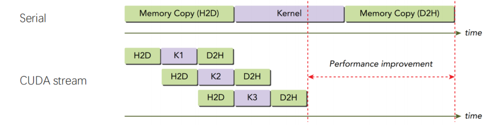
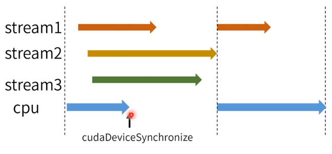
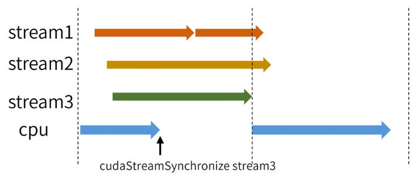
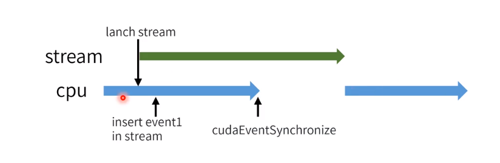
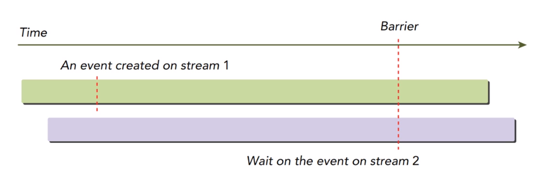

# 进阶知识点

## `CUDA Kernel`

参考链接：

[CSDN](https://blog.csdn.net/qq_43398345/article/details/130489853)


## `CUDA Stream`

*`CUDA stream`是`GPU`上task的执行队列，所有`CUDA`操作（kernel，内存拷贝等）都是在stream上执行的。*

有两种类别：

- 隐式流（默认）
- 显式流

其中隐式流里的`GPU`任务和`CPU`端计算是同步的，显式流相反。


优点：

• CPU计算和kernel计算并行

• CPU计算和数据传输并行

• 数据传输和kernel计算并行

• kernel计算并行


使用情况：

当数据量和计算量较大的时候使用才会有较好的加速效果，因为流的申请相比`CUDA core`的计算是更更耗时的。


注意：

因为CPU和`GPU`的数据传输是经过`PCIe`总线的，`PCIe`上的操作是顺序的，所以相同的数据拷贝操作是不能同时进行的。




### **`API`接口**

```c++
// 定义
cudaStream_t stream;
// 创建
cudaStreamCreate(&stream);
// 数据传输
cudaMemcpyAsync(dst, src, size, type, stream);
// kernel在流中执行
kernel_name<<<grid, block, sharedMemSize, stream>>>(argument list);
// 同步
cudaError_t cudaStreamSynchronize(cudaStream_t stream)
// 查询
cudaError_t cudaStreamQuery(cudaStream_t stream);
// 销毁
cudaError_t cudaStreamDestroy(cudaStream_t stream);
```


### `CUDA`同步操作:timer_clock:

显式同步可以分为四类：

- `cudaDeviceSynchronize`，同步该设备上的所有流

效果：等待所有**已经开始执行的流**执行完。



- `cudaStreamSynchronize`，同步一个流

效果：等待指定流执行完，影响单个流和CPU。



- `cudaEventSynchronize`，同步`Event`

效果：等待`Event`标记的流执行完之后，`Event`标记生效，影响CPU。



- `cudaStreamWaitEvent`，同步插入相同`Event`的流

效果：有一个插入`Event`的流1，当利用`cudaStreamWaitEvent`对流2插入相同的`Event`时，流2会停止执行，等待流1执行完，`Event`生效。




### 实例操作

参考链接：[知乎](https://zhuanlan.zhihu.com/p/51402722)

```c++
#include <cuda_runtime.h>
#include <iostream>

#define STREAMNUMS 10

__global__ void vecAddKernel(float* A_d, float* B_d, float* C_d, int n)
{
    int i = threadIdx.x + blockDim.x * blockIdx.x;
    if (i < n) C_d[i] = A_d[i] + B_d[i];
}

int main(int argc, char* argv[])
{
    // 初始化输入
    int n = atoi(argv[1]);
    std::cout << "计算向量的级数: " << n << std::endl;

    // 申请主机内存
    size_t size = n * sizeof(float);
    float* a = (float*)malloc(size);
    float* b = (float*)malloc(size);
    float* c = (float*)malloc(size);

    for (int i = 0; i < n; i++)
    {
        float af = rand() / double(RAND_MAX);
        float bf = rand() / double(RAND_MAX);
        a[i] = af;
        b[i] = bf;
    }

    // 申请设备指针
    float* a_d = nullptr;
    float* b_d = nullptr;
    float* c_d = nullptr;

    // 线程块所含线程的数量和网格所含线程筷的数量
    int threadPerBlock = 256;
    int blockPerGrid = (n + threadPerBlock - 1) / threadPerBlock;

    // 创建流
    cudaStream_t streams[STREAMNUMS];
    for (int i = 0; i < STREAMNUMS; i++)
    {
        cudaStreamCreate(&streams[i]);
    }

    // 定义偏移量
    int offset = 0;
    // 每个流的数据量大小
    const int dataBlock = n / STREAMNUMS;
    // 循环启动stream
    for (int i = 0; i < STREAMNUMS; i++)
    {
        std::cout << "接下来开始进行流操作" << i << std::endl;
        offset = dataBlock * i;
        cudaMemcpyAsync(a_d + offset, a + offset, dataBlock, cudaMemcpyHostToDevice, streams[i]);
        cudaMemcpyAsync(b_d + offset, b + offset, dataBlock, cudaMemcpyHostToDevice, streams[i]);
        vecAddKernel<<<threadPerBlock, blockPerGrid>>>(a_d, b_d, c_d, dataBlock);
        cudaMemcpyAsync(c + offset, c_d + offset, dataBlock, cudaMemcpyHostToDevice, streams[i]);
    }

    // cudaDeviceSynchronize();
    // 同步流
    for (int i = 0; i < STREAMNUMS; i++)
    {
        cudaStreamSynchronize(streams[i]);
    }
    for (int i = 0; i < STREAMNUMS; i++)
    {
        cudaStreamDestroy(streams[i]);
    }

    cudaFree(a_d);
	cudaFree(b_d);
	cudaFree(c_d);

    std::cout << "正常运行" << std::endl;

	free(a);
	free(b);
	free(c);

    return 0;
}
```


**默认流和显示流交叉使用的情况**

**单线程内，**正常编译的默认流是同步执行的，如果需要默认流也是异步执行，实现与显式流并行的情况，可以这样编译

```bash
nvcc ${fileCUDA} -o ${cudaOut}
# 修改成
nvcc --default-stream per-thread ${fileCUDA} -o ${cudaOut}
```

加上这个参数之后，默认流变成了显式流。


## `CUDA Event`

CUDA Event，在stream中插入一个事件，类似于打一个标记位，用来记录stream是否执行到 当前位置。Event有两个状态，已被执行和未被执行。

### `API`接口

```c++
// 定义
cudaEvent_t event
// 创建
cudaError_t cudaEventCreate(cudaEvent_t* event);
// 插入流中
cudaError_t cudaEventRecord(cudaEvent_t event, cudaStream_t stream = 0);
// 销毁
cudaError_t cudaEventDestroy(cudaEvent_t event);
// 同步
cudaError_t cudaEventSynchronize(cudaEvent_t event);
// 查询
cudaError_t cudaEventQuery(cudaEvent_t event);
// 进阶同步函数
cudaError_t cudaStreamWaitEvent(cudaStream_t stream, cudaEvent_t event);
```


### 实例操作，测时间

```c++
// 插入Event，测时间
float time_elapsed = 0;
cudaEvent_t start, stop;
cudaEventCreate(&start);
cudaEventCreate(&stop);

cudaEventRecord(start, 0);
KernelFuncName<<<grid, block>>> (params list);
cudaEventRecord(stop, 0);

// 同步等待，计算最终时间
cudaEventSynchronize(start);
cudaEventSynchronize(stop);
cudaEventElapsedTime(&time_elapsed, start, stop);
printf("执行时间: %f(ms)\n", time_elapsed);

// 销毁
cudaEventDestroy(start);
cudaEventDestroy(stop);
```


## NVIDIA Visual Profiler (NVVP)

- 随CUDA安装，不需要额外安装。
- 可自定义配置+图形化界面，可以快速找到程序中的性能瓶颈。
- 以时间线的形式展示CPU和GPU操作。 
- 可以查看数据传输和kernel的各种软件参数（速度，kernel启动时间等）和硬件参数（L1 cache命中率等）。


## 宏定义

参考链接：

[CSDN](https://blog.csdn.net/weixin_44444450/article/details/108623437)

[cuda学习4--CSDN](https://blog.csdn.net/qq_45605440/article/details/127730326)


提前定义好相应的宏，简化代码

宏定义每一行都需要加一个`\`，可以理解为“继续符”的意思，**表示本行与下一行连接起来。**


# 矩阵乘法进阶:chart_with_upwards_trend:

代码的对比链接：[CSDN](https://blog.csdn.net/sinat_38368658/article/details/105117534)

使用共享内存，并利用平铺矩阵方法计算


具体代码：

```c++
#include <iostream>
#include <cuda_runtime.h>

#define M 512
#define K 512
#define N 512

#define BLOCK_SIZE 32 
#define width 512

__global__ void multiplicateMatrixShareMemory(float* Md, float* Nd, float* Pd)
{
    // 开辟共享内存
    __shared__ float Mds[BLOCK_SIZE][BLOCK_SIZE];
    __shared__ float Nds[BLOCK_SIZE][BLOCK_SIZE];

    int bx = blockIdx.x;
    int by = blockIdx.y;
    int tx = threadIdx.x;
    int ty = threadIdx.y;

    // 标识计算结果Pd对应的行列，这样就确认好了矩阵单个元素对应的线程
    int Row = by * BLOCK_SIZE + ty;
    int Col = bx * BLOCK_SIZE + tx;

    float Pvalue = 0;

    // 注: 同一BLOCK_SIZE内的块相加后的结果才是对应的Pd单元素的结果
    // 这里利用for循环，计算同一BLOCK_SIZE内的块
    // width / BLOCK_SIZE对应块的数目
    for (int m = 0; m < width / BLOCK_SIZE; m++)
    {
        // 这里对应
        // Mds[ty][tx] = Md[Row][tx]
        // Nds[ty][tx] = Nd[ty][Col]
        // 但全局内存中二维数组是以一维数组的形式保存的，共享内存则不一样，所以这里需要对Md和Nd进行索引转换
        // 实现从两个矩阵中各取一个元素存入共享内存
        Mds[ty][tx] = Md[Row * width + (m * BLOCK_SIZE + tx)];
        Nds[ty][tx] = Nd[(m * BLOCK_SIZE + ty) * width + Col];
        // 等待所有线程都将对应元素存入共享内存中
        __syncthreads();

        // 累加块相乘后的子集
        for (int k = 0; k < BLOCK_SIZE; k++)
        {
            Pvalue += Mds[ty][k] + Nds[k][tx];
        }
        // 同步结果，保证完全计算完当前块后，再进下一个for循环，计算下一个块
    }
    // 最后把结果写入全局内存Pd中
    Pd[Row * width + Col] = Pvalue;
}

int main(int argc, char* argv[])
{
    // 1.组织数据
	int Axy = M * K;
	int Bxy = K * N;
	int Cxy = M * N;

    float *h_A, *h_B, *deviceRef;
	h_A = (float*)malloc(Axy * sizeof(float));
	h_B = (float*)malloc(Bxy * sizeof(float));
    deviceRef = (float*)malloc(Cxy * sizeof(float));

    initial(h_A, Axy);
    initial(h_B, Bxy);
    printf("1");

    // 2.申请设备端内存
    float *d_A, *d_B, *d_C;
	cudaMalloc((void**)&d_A, Axy * sizeof(float));
	cudaMalloc((void**)&d_B, Bxy * sizeof(float));
	cudaMalloc((void**)&d_C, Cxy * sizeof(float));

    cudaMemcpy(d_A, h_A, Axy * sizeof(float), cudaMemcpyHostToDevice);
	cudaMemcpy(d_B, h_B, Bxy * sizeof(float), cudaMemcpyHostToDevice);

    // 3.组织线程配置，调用核函数
    dim3 grid(width / BLOCK_SIZE, width / BLOCK_SIZE);
    dim3 block(BLOCK_SIZE, BLOCK_SIZE);
    multiplicateMatrixShareMemory<<<grid, block>>> (d_A, d_B, d_C);
    cudaMemcpy(deviceRef, d_C, Cxy * sizeof(float), cudaMemcpyDeviceToHost);

    cudaFree(d_A);
	cudaFree(d_B);
	cudaFree(d_C);

	free(h_A);
	free(h_B);
	free(deviceRef);

    return 0;
}
```


## 线程配置进阶

参考资料：

[知乎](https://zhuanlan.zhihu.com/p/442304996)

[简书](https://www.jianshu.com/p/983e9a516522)


# `cuBLAS`

学习网站：

[NVIDIA](https://docs.nvidia.com/cuda/cublas/index.html)

`cuBLAS`是一个BLAS的实现，允许用户使用NVIDIA的GPU的计算资源，其中数组是列优先的，索引从1开始，有三类函数（向量标量、向量矩阵、矩阵矩阵）。


## 辅助函数

句柄管理函数

- `cublasCreate()`
- `cublasDestroy()`

流管理函数

- `cublasSetStream()`
- `cublasGetStream()`


### `cuBLAS`标量/向量

返回`x`最大值：

- `cublasStatus_t cublasIsamax(cublasHandle_t handle, int n, const float *x, int incx, int *result) `

返回`x`最小值：

- `cublasStatus_t cublasIsamin(cublasHandle_t handle, int n, const float *x, int incx, int *result)`

实现功能：`result = max/min(x)`

参数意义：

- `int incx`表示元素的存储间隔，因为默认是列优先


### `cuBLAS`矩阵向量

```c++
cublasStatus_t cublasSgemv(cublasHandle_t handle, 
                           cublasOperation_t trans, // A是否转置
                           int m, int n, // A的行列数
                           const float *alpha, const float *A, 
                           int lda, // leading dimension, A不转置则正常按照cublas的列优先，输入的是行数m，反之输入列数n
                           const float *x, int incx, // incx和incy是对应向量的存储间隔
                           const float *beta, float *y, int incy)
```

实现功能：`y = alpha * op(A) * x + beta * y`，其中A是矩阵，x/y是向量。


### `cuBLAS`矩阵矩阵

```c++
cublasStatus_t cublasSgemm(cublasHandle_t handle, 
                           cublasOperation_t transa, cublasOperation_t transb, // 控制AB是否转置
                           int m, int n, int k,  // A(m*k)   B(k*n)   矩阵的行列
                           const float *alpha, const float *A, int lda, //若转置按行优先，则leading dimension为A/B的列数
                           const float *B, int ldb,
                           const float *beta, 
                           float*C, int ldc)  // C矩阵一定按列优先，则leading dimension为C的行数
```

实现功能：`C = alpha * op(A) * op(B) + beta * C`


### `cuBLAS`矩阵分块乘法

```c++
cublasStatus_t cublasSgemmBatched(cublasHandle_t handle,
                                  cublasOperation_t transa, cublasOperation_t transb,
                                  int m, int n, int k,
                                  const float *alpha, const float*Aarray[], int lda,
                                  const float *Barray[], int ldb, const float *beta,
                                  float*Carray[], int ldc,
                                  int batchCount)
```

实现功能：`C[i] = alpha * op (A[i]) * op (B[i]) + beta * C[i]`


## 实例操作

```c++
#include "cublas_v2.h"
#include <cuda_runtime.h>
#include <iostream>

#define M 512
#define N 512
#define K 512

void initial(float *array, int size)
{
	for (int i = 0; i < size; i++)
	{
		array[i] = (float)(rand() % 10 + 1);
	}
}

int main(int argc, char* argv[])
{
    // 组织数据
    // 定义矩阵元素个数
    int numsA = M * K;
    int numsB = K * N;
    int numsC = M * N;

    // define pointer of host and device 
    float *A, *B, *C, *deviceA, *deviceB, *deviceC;
    // 矩阵内存大小
    size_t sizeA = numsA * sizeof(float);
    size_t sizeB = numsB * sizeof(float);
    size_t sizeC = numsC * sizeof(float);
    // 根据size在host端开辟内存
    A = (float*)malloc(sizeA);
    B = (float*)malloc(sizeB);
    C = (float*)malloc(sizeC);
    // 初始化矩阵
    initial(A, numsA);
    initial(B, numsB);
    // 根据size在设备端开辟内存
    cudaMalloc((void**) &deviceA, sizeA);
    cudaMalloc((void**) &deviceB, sizeB);
    cudaMalloc((void**) &deviceC, sizeC);
    // 将AB转移到设备端
    cudaMemcpy(deviceA, A, sizeA, cudaMemcpyHostToDevice);
    cudaMemcpy(deviceB, B, sizeB, cudaMemcpyHostToDevice);

    // 创建句柄
    cublasHandle_t handle;
    cublasCreate(&handle);

    // 创建Event，计算耗时
    float elapsedTime = 0;
    cudaEvent_t start, stop;
    cudaEventCreate(&start);
    cudaEventCreate(&stop);
    // 标记流
    cudaEventRecord(start, 0);

    // alpha beta
    float a = 1, b = 0;
    cublasSgemm(
        handle,  // 句柄
        CUBLAS_OP_T,  // A是否转置
        CUBLAS_OP_T,  // B是否转置
        M,  // A的行
        N,  // B的列
        K,  // A的列和B的行
        &a,  // alpha
        deviceA,  // 设备端A的指针
        K,  // leading dimension，转置，故输入A的列数
        deviceB,  // 设备端B的指针
        N,  // leading dimension，转置，故输入B的列数
        &b,  // beta
        deviceC,  // 设备端C的指针
        M  // C的leading dimension，C矩阵一定按列优先，则leading dimension为C的行数
    );
    // 将计算结果拷贝回host
    cudaMemcpy(C, deviceC, sizeC, cudaMemcpyDeviceToHost);
    // 等待同步，然后标记结束，并计算时间，销毁Event
    cudaDeviceSynchronize();
    cudaEventRecord(stop, 0);
    cudaEventSynchronize(stop);
    cudaEventElapsedTime(&elapsedTime, start, stop);
    cudaEventDestroy(start);
    cudaEventDestroy(stop);
    printf("GPU运行时间为: %fs\n", elapsedTime / 1000);

    cudaFree(deviceA);
    cudaFree(deviceB);
    cudaFree(deviceC);

    free(A);
    free(B);
    free(C);

    // cudaDeviceReset();
    cublasDestroy(handle);

    return 0;
}
```


编译方法：

`nvcc CublasTest.cu -lcublas -o cuBlasTest`


# `cuDNN`

## 辅助函数


## 实例操作（添加宏定义进行报错标记）

```c++
#include <cudnn.h>
#include <iostream>
#include <cuda_runtime.h>

#define CHECK_CUDA(){\
    if(cudaPeekAtLastError() != cudaSuccess){\
        printf("CUDA error in line %d of file %s:%s\n", __LINE__, __FILE__, cudaGetErrorString(cudaGetLastError()));\
        exit(-1);\
    }\
}\

#define CUDA_CALL(cudaFunc){\
    if(cudaFunc != cudaSuccess){\
        print("CUDA error in line %d of file %s:%s\n", __LINE__, __FILE__, cudaGetErrorString(cudaGetLastError()));\
        exit(-1);\
    }\
}\


```

