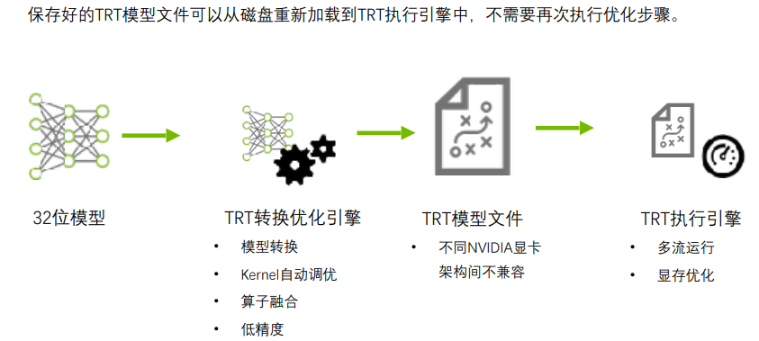

# 基本介绍

1. 创建Builder

2. 创建Network

3. 使用`API`or `Parser`构建Network

   `API`构建网络需要逐层构建，繁琐且耗时

   `Parser`构建网络相对简单

   在构建好模型之后，还需要设置输入批量大小

4. 优化网络

5. 序列化和反序列化模型

6. host -> device

7. 执行计算

8. device -> host




## 优化策略

1. 低精度优化
2. Kernel自动调优
3. 算子融合
4. 多流运行
5. 显存优化


## 实例操作

参考链接：

[Github](https://github.com/NVIDIA/TensorRT/blob/release/8.0/samples/sampleMNIST/sampleMNIST.cpp)

利用`caffe`解析器构建模型

```c++
#include "argsParser.h"
#include "buffers.h"
#include "common.h"
#include "logger.h"

#include <cuda_runtime_api.h>
#include "NvInfer.h"
#include <iostream>
#include <NvCaffeParser.h>

#define CUDA_CALL(cudaFunc){\
    if(cudaFunc != cudaSuccess){\
        printf("CUDA error in line %d of file %s:%s\n", __LINE__, __FILE__, cudaGetErrorString(cudaGetLastError()));\
        exit(-1);\
    }\
}\

class SampleMNIST
{
    public:
    bool build();
    //!
    //! \brief Runs the TensorRT inference engine for this sample
    //!
    bool infer();

    private:
    bool constructNetwork(
        samplesCommon::SampleUniquePtr<nvcaffeparser1::ICaffeParser>& parser,
        samplesCommon::SampleUniquePtr<nvinfer1::INetworkDefinition>& network);
    //!
    //! \brief 根据两个智能指针构建网络
    //! \brief Reads the input and mean data, preprocesses, and stores the result in a managed buffer
    //!
    std::shared_ptr<nvinfer1::ICudaEngine> mEngine{nullptr};  //!< The TensorRT engine used to run the network. 即推理引擎
    samplesCommon::CaffeSampleParams mParams;  //!< The parameters for the sample.
};

bool SampleMNIST::build()
{
    // 1.定义构建模型需要的智能指针
    auto builder = samplesCommon::SampleUniquePtr<nvinfer1::IBuilder>(nvinfer1::createInferBuilder(sample::gLogger.getTRTLogger()));
    auto network = samplesCommon::SampleUniquePtr<nvinfer1::INetworkDefinition>(builder->createNetworkV2(0));
    auto config = samplesCommon::SampleUniquePtr<nvinfer1::IBuilderConfig>(builder->createBuilderConfig());
    auto parser = samplesCommon::SampleUniquePtr<nvcaffeparser1::ICaffeParser>(nvcaffeparser1::createCaffeParser());

    // 2.进行构建设置
    if (!constructNetwork(parser, network))
    {
        return false;
    }
    // 输入批量大小
    builder->setMaxBatchSize(mParams.batchSize);
    // 构建时最大工作空间大小，一般设置成最大显存
    config->setMaxWorkspaceSize(8_MiB);
    config->setFlag(BuilderFlag::kGPU_FALLBACK);
    config->setFlag(BuilderFlag::kSTRICT_TYPES);
    // 开启半精度或者INt8
    if (mParams.fp16)
    {
        config->setFlag(BuilderFlag::kFP16);
    }
    if (mParams.int8)
    {
        config->setFlag(BuilderFlag::kINT8);
    }

    // 3.构建Engine
    mEngine = std::shared_ptr<nvinfer1::ICudaEngine>(builder->buildEngineWithConfig(*network, *config), samplesCommon::InferDeleter());

    return true;
}
```

