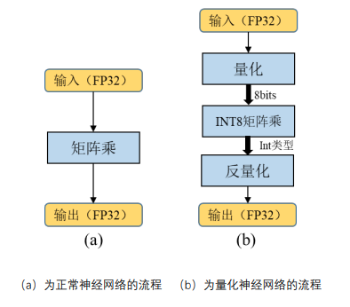

# `TensorRT Plugin`

`Plugin`存在的意义：

1. 实现不支持的算子
2. 合并算子，进行深度优化


## `Plugin`介绍

对于复杂网络，合并算子是非常有意义的。

主要是模型数据处理的部分，如`split`、`cat`、`transpose`等，可以合并成一个算子，在一个kernel里运行。


## 工作流程

1. 编写`plugin`
2. 编写`plugin creator`
3. 注册`plugin creator`
4. 序列化，将参数和权值写到文件中


反序列化过程和原理

1. 从文件中读取`pluginType`和`pluginVersion`
2. 根据`pluginType`和`pluginVersion`从`getPluginRegistry`中获得`creator`
3. 使用`creator`根据参数生成`plugin`，并通过`addPlugin`添加到`network`中


## `Plugin API`

`plugin`基类：`IPluginV2IOExt / IPluginV2DynamicExt`

注意：Static Shape，用`IPluginV2IOExt`；Dynamic Shape，则使用`IPluginV2DynamicExt`。


# 量化加速

`FP32`：32位，4字节，由1个符号位、8个指数位、23个值位组成。

`FP16`：16位，保留符号位，其余位减半，精度会降低。

用法：`config->setFlag(BuilderFlag::kFP16)`

检测：`builder->platformHasFastFp16()`、`builder->platformHasFastInt8()`


## `INT8`量化

将基于浮点的模型转换成低精度的`INT8`数值进行运算，加快推理速度。



1. 对于计算能力大于等于SM_61的显卡，`NVIDIA`提供了新的`INT8`点乘运算的指令支持`DP4A`。该计算过程可以获得理论上最大4倍的性能提升。（指令或者软件加速）
2. Volta架构中引入了Tensor Core也能加速`INT8`运算。（硬件加速）


`FP16`和`INT8`能加速的本质：

通过指令或硬件技术，在单位时钟周期内，这两种类型的运算次数更大。


**为什么`INT8`量化不会大幅损失精度？**

1. 这种量化可以看作是一种噪声。
2. 好的深度模型，权值分布大部分都是正态分布，值域小且对称。


## `INT8`量化算法

1. 动态对称量化算法

   取模最大值，然后根据`scale`进行映射。

   优点：算法简单，量化步骤耗时短；

   缺点：会造成位宽浪费，影响精度。

2. 动态非对称量化算法

   取模最大值和最小值。

   优点：不会造成位宽浪费，精度有保证；

   缺点：算法复杂，步骤耗时长。

3. **静态对称量化算法**

   推理时使用**预先统计**的缩放阈值，**截断**部分阈值外的数据；

   优点：算法最简单，量化耗时时间最短，精度也有所保证；

   缺点：构建量化网络比较麻烦。


**缩放阈值由饱和机制确定**

1. 首先利用calibration dataset，给定一个`batchsize`去计算每一层的数值分布
2. 然后利用不同的截断阈值得到的推理结果和`FP32`的推理结果计算`KL`距离
3. 最后选取最合适的缩放阈值


## 实例操作

核心部分：

```c++
if (dataType == DataType::kINT8) config->setFlag(BuilderFlag::kINT8);
if (dataType == DataType::kINT8) config->setInt8Calibrator(calibrator.get());
```

